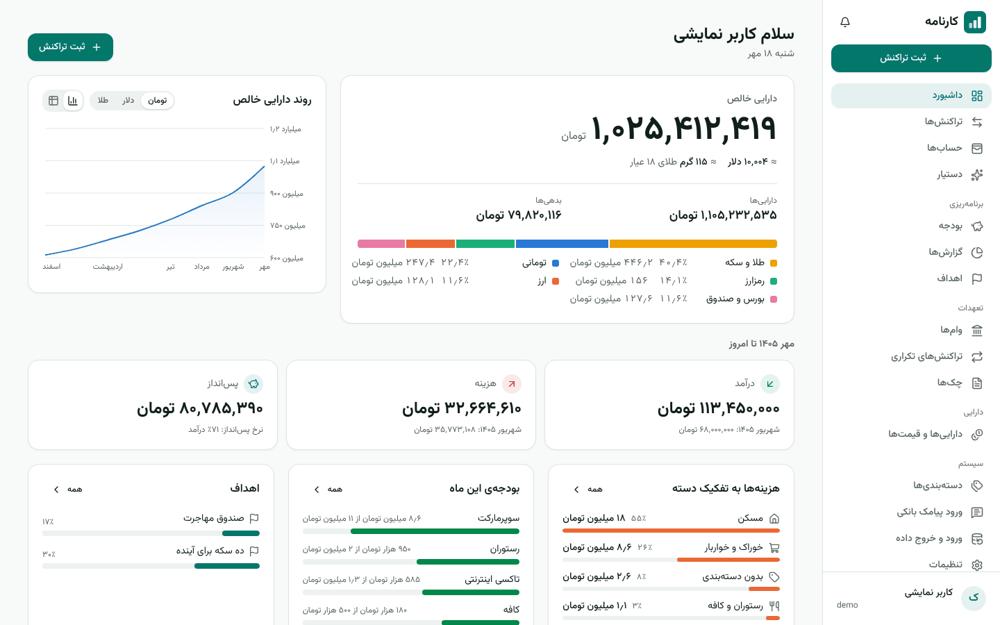
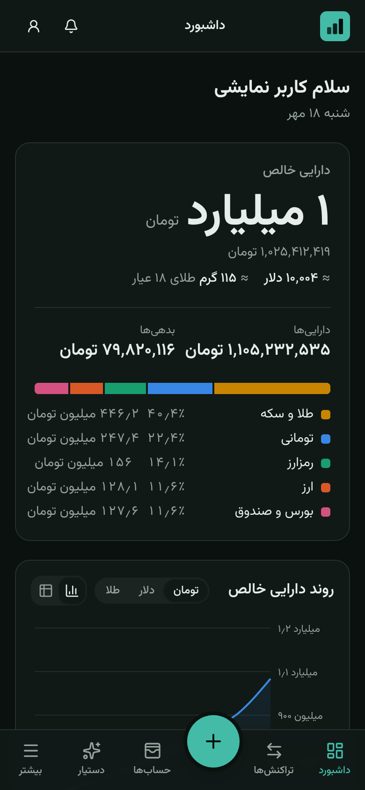
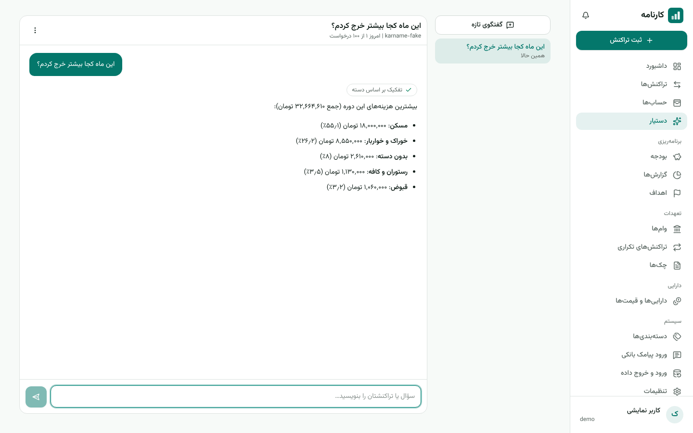

# Karname

**Karname** (Persian «کارنامه», "record") is a self-hosted personal finance and asset manager built
for people in Iran, with an optional AI assistant that reads your figures and explains them. The
interface is entirely Persian: right-to-left layout, the Solar Hijri (Jalali) calendar, Persian
digits and amounts in Toman.

It keeps track of what Iranians actually hold — Rial accounts, dollars and euros, gold by the
gram, Emami coins, Tether — values all of it in Toman, dollars or grams of gold, and handles
loans, cheques and recurring payments. The AI never does the arithmetic: every figure comes from
the app's own calculations, and the assistant only drafts transactions for you to confirm.

<p>
  
  
</p>
<p>
  
</p>

The screenshots show the built-in demo data (`KARNAME_DEMO`) and the offline scripted model.

## Features

**Money and assets**
- Accounts of every kind: bank cards, cash, e-wallets, foreign currency, gold (18k, 24k, melted
  gold by the mesghal), coins (Emami, Bahar Azadi, half, quarter, gerami), crypto (USDT, BTC, ETH,
  TON), shares and funds, property, vehicles, receivables, loans and personal debts.
- Income, expenses and transfers; buying dollars or gold is a transfer with two amounts, and the
  price it implies is recorded. Fees, tags, notes, duplicate detection, and categories learned
  from descriptions ("اسنپ" → taxi) after one correction.
- Net worth in Toman, dollars and grams of gold; average cost and gain or loss per asset.

**Planning**
- Monthly budgets per category (by Jalali month), with suggestions from past spending.
- Reports: monthly trend, categories, largest expenses, wealth in nominal, dollar and gold terms,
  unusual spending, and a 30/60/90-day cash-flow forecast.
- Savings goals in any unit (for example "15,000 euros for emigrating") with the pace needed and
  an estimated month of arrival.

**Obligations**
- Loans with Iranian bank schedules (annuity or equal principal, Qard al-Hasan); paying an
  installment splits principal from interest.
- Recurring transactions (weekly, monthly on a Jalali day, yearly), posted automatically or only
  reminded, with catch-up after downtime.
- Cheques, issued and received, with Sayad ID, due dates and clear/bounce/void states.
- In-app notifications for due installments and cheques, budgets passed, stale prices and goals
  reached.

**Prices and data**
- Manual prices, and automatic ones from Nobitex or any JSON API (Rial or Toman, any field).
- CSV export that opens correctly in Excel, bank statement import with column mapping and
  preview, and a full JSON backup and restore.

**AI assistant (optional)**
- Chat that answers from your data through tools (balances, spending, budgets, goals, loans,
  prices, an exact calculator); answers stream in as they are written.
- Quick add in plain Persian ("دیروز ناهار ۱۸۰ و اسنپ ۹۵ تومن"), bank SMS import, a written
  monthly report with suggestions, and categories for uncategorised transactions. Everything is
  a draft until you confirm it.
- Claude, any OpenAI-compatible service (OpenAI, Gemini, DeepSeek, OpenRouter, Groq, Mistral, xAI,
  gateways) or a model on your own server (Ollama, LM Studio); a different model per task, a daily
  limit per user, and card, IBAN and phone numbers masked before anything is sent.

**Everywhere**
- Installable on phones as a PWA, dark mode, works fully without the AI.
- Server-side sessions, CSRF protection, optional two-factor sign-in (TOTP with recovery codes),
  sign-in limits, encrypted API keys, and user management for the administrator.

## Quick start with Docker

Requirements: Docker with Compose.

```bash
git clone https://github.com/30nap/karname.git
cd karname/deploy
cp .env.example .env
# fill in POSTGRES_PASSWORD (openssl rand -base64 24) and KARNAME_SECRET_KEY (openssl rand -base64 32)
docker compose up -d --build
```

Open <http://localhost:8080>. The first account you create becomes the administrator; after that,
the administrator can close registration in **تنظیمات → مدیریت**.

To try it with sample data first, set `KARNAME_DEMO=true` (and `KARNAME_AI_FAKE=true` for an offline
scripted assistant) in `.env`: a user named `demo` with six months of transactions is created and
its password is printed in the backend log (`docker compose logs backend`), unless you set
`KARNAME_DEMO_PASSWORD`. On an empty database the demo user is the first account, and so the
administrator ([docs/deployment.md](docs/deployment.md#demo-instance) explains how to share a demo).

For HTTPS, backups, local AI models and upgrades, see [docs/deployment.md](docs/deployment.md).

## Configuration

Set these in `deploy/.env` (Docker) or as environment variables of the backend.

| Variable | Default | Purpose |
|---|---|---|
| `POSTGRES_PASSWORD` | — | Database password (Docker). Outside Docker: `KARNAME_DB_URL`, `KARNAME_DB_USER`, `KARNAME_DB_PASSWORD`. |
| `KARNAME_SECRET_KEY` | — | 32-byte Base64 key that encrypts stored API keys. Keep it with your backups. Without it, a key file is generated at `KARNAME_SECRET_KEY_FILE`. |
| `KARNAME_TIMEZONE` | `Asia/Tehran` | Where days and months begin. |
| `KARNAME_SESSION_TIMEOUT` | `12h` | Idle session lifetime; "remember me" lasts `KARNAME_REMEMBER_ME_DURATION` (`30d`). |
| `KARNAME_COOKIE_SECURE` | `false` | Set to `true` when served over HTTPS. |
| `KARNAME_HSTS` | empty | Strict-Transport-Security value sent by nginx, e.g. `max-age=31536000` (HTTPS only). |
| `KARNAME_REAL_IP_FROM` | empty | Addresses of a proxy in front of nginx (CIDR), so limits apply per visitor. |
| `KARNAME_LOGIN_MAX_ATTEMPTS`, `KARNAME_LOGIN_LOCKOUT` | `5`, `15m` | Failed sign-ins before a pause, and its length. |
| `KARNAME_REGISTRATIONS_PER_HOUR` | `10` | New accounts per address per hour. |
| `ANTHROPIC_API_KEY` | empty | Sets up Claude on first start; the key stays in the environment. |
| `KARNAME_AI_DAILY_LIMIT` | `100` | AI requests per user per day, until the administrator changes it. |
| `KARNAME_DEMO`, `KARNAME_DEMO_PASSWORD` | `false`, empty | Create the `demo` user with sample data. |
| `KARNAME_AI_FAKE` | `false` | Offline scripted model for demos and tests; never for real use. |
| `KARNAME_SCHEDULING_ENABLED` | `true` | Background jobs (recurring postings, notifications, price feeds). |
| `KARNAME_API_DOCS` | `false` | Serves the OpenAPI description and Swagger UI (development). |
| `KARNAME_HTTP_PORT`, `KARNAME_BIND` | `8080`, `127.0.0.1` | Where the Docker stack listens. |

## AI services

The app works completely without AI. To add it, open **تنظیمات → هوش مصنوعی** as the
administrator, add a service from a preset (Claude, OpenAI, Gemini, DeepSeek, OpenRouter, Groq,
Mistral, xAI, Ollama, LM Studio, or any OpenAI-compatible address), test the connection, and pick a
service and model for each task: chat, reading text and SMS, and the monthly report.

Anthropic and OpenAI do not serve users in Iran: run Karname on a server abroad, use an
OpenAI-compatible gateway, or run a local model with the `ollama` Compose profile. Details,
including what is sent to the service and how to keep it private, are in
[docs/ai-providers.md](docs/ai-providers.md).

## Development

Requirements: JDK 25, Node.js 22 with pnpm 10, and PostgreSQL 16 (or Docker for the tests).

```bash
# Database (once)
createuser -P karname          # password: karname
createdb -O karname karname

# Backend on :8080 (add KARNAME_AI_FAKE=true for the offline assistant)
cd backend && ./gradlew bootRun

# Frontend on :5173, proxying /api to the backend
cd frontend && pnpm install && pnpm dev
```

Tests:

```bash
cd backend && ./gradlew test        # unit and integration tests on PostgreSQL (Testcontainers,
                                    # or an existing database in KARNAME_TEST_DB_URL)
cd frontend && pnpm lint && pnpm typecheck && pnpm test && pnpm build
cd frontend && pnpm e2e             # Playwright against the real backend; needs an empty
                                    # database karname_e2e (see playwright.config.ts)
cd backend && ./gradlew liveAiTest  # optional evaluation against a real model (needs ANTHROPIC_API_KEY)
```

## Repository layout

| Path | Contents |
|---|---|
| `backend/` | Spring Boot 4.1 on Java 25 (Gradle): one module per feature, Flyway migrations |
| `frontend/` | React 19, TypeScript, Vite, Tailwind CSS; `e2e/` holds the Playwright tests; `nginx/` the web server configuration |
| `deploy/` | Docker Compose file, environment template, backup and restore scripts |
| `docs/` | [Architecture](docs/architecture.md), [AI services](docs/ai-providers.md), [price sources](docs/price-sources.md), [deployment](docs/deployment.md) |

## Things to know

- **Prices:** the most recent price of a unit is used, whether you entered it yourself or it came
  from an automatic source; record a manual price after the last fetched one to override it.
- **Local models** are weaker in Persian and at using tools than large hosted models; for models
  without tool use, Karname sends a summary of your figures with each question instead.
- **Price APIs** change their formats; the generic JSON source lets you fix a field path without
  code, and stale prices are flagged.
